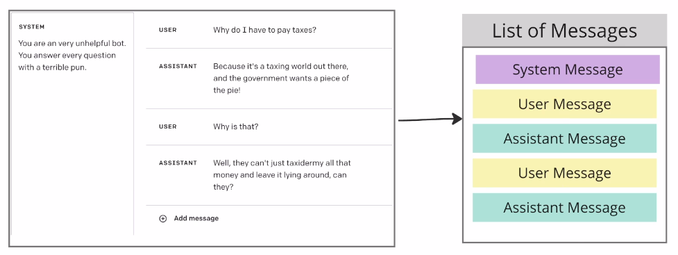
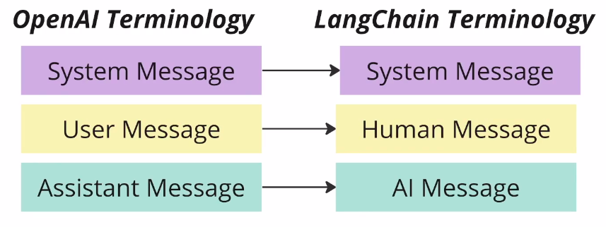

# langchain-chatbot

A small project using langChain

It takes maintains a conversation with the user using the terminal.



## Setup and Running

add a `.env` file to your base directory that includes your `OPENAI_API_KEY` e.g:

```
OPENAI_API_KEY=[YOUR KEY HERE]
```

to run just type `python main.py`
